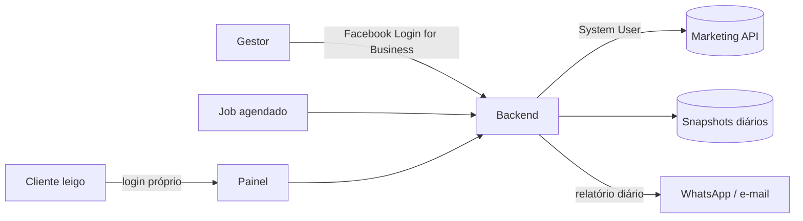

# Meta Graph API (Marketing API)

**Arquivo:** `src/services/metaGraphApi.ts`. É a única integração com a Meta, e hoje **só lê os dados básicos da conta**, sem alterar nada. Campanhas, anúncios e histórico diário ainda vêm do mock ([[o-que-e-simulado]]).

## O que existe hoje
Uma chamada, feita direto do navegador pelo [[modal-conectar-meta]] e pelo botão **Atualizar** do cabeçalho:
```
GET https://graph.facebook.com/v23.0/{act_id}
    ?fields=name,business_name,account_status,currency,amount_spent,timezone_name
    &access_token={token}
```
| Função | O que faz |
|---|---|
| `fetchMetaAccount` | Valida token e ID, faz a chamada e traduz o erro da Meta em título e orientação |
| `normalizeAccountId` | Aceita `act_123`, `123` ou `act_ 123`; exige pelo menos 5 dígitos |
| `buildConnectedAccount` | Monta a conta com `isRealApi: true`, sem campanhas nem histórico, e um `apiSnapshot` (situação, gasto total, fuso, hora da leitura) |
| `saveMetaConfig` / `getSavedMetaConfig` / `removeMetaConfig` | Guardam `{accessToken, adAccountId}` na chave `clareza_meta_api_config` |

- A versão fica na constante `META_GRAPH_API_VERSION`, que o rodapé e o aviso exibem.
- `amount_spent` vem na menor unidade da moeda. O código descobre as casas decimais da moeda com `Intl`, em vez de dividir por 100 às cegas.
- `account_status` vira rótulo em pt-BR (Ativa, Desativada, Pagamento pendente...).
- Erros com mensagem própria: 190 (token inválido ou expirado), 100 (conta não encontrada), 10 e 200 a 299 (permissão), 4, 17, 32 e 613 (limite de consultas) e falha de rede, que também cobre bloqueador de anúncios barrando `graph.facebook.com`.
- Nas cinco telas, a conta real mostra o `ApiAccountNotice` (`src/components/screens/ApiAccountNotice.tsx`): o quadro "Dados lidos da Meta" e o aviso "Ainda não importamos...". Conta real nunca recebe número inventado.

## Armadilhas
- **Token no navegador:** vai na query string e fica no `sessionStorage`, ou no `localStorage` se o gestor marcar "Lembrar neste navegador". Serve para protótipo local, não para produção ([[seguranca]]).
- **Token do Graph API Explorer expira em horas.** O modal orienta a criar um token de usuário do sistema no Business Manager, que não expira. Se o token sumiu (aba fechada sem "Lembrar"), o **Atualizar** pede para colar de novo.
- **A conta conectada sempre vai para o `localStorage`** (`ab_adsdesk_connected_account`), mesmo sem "Lembrar": nome e gasto continuam na lista depois de fechar o navegador, só o token some ([[persistencia-localstorage]]).
- **Versões da Graph API vencem** cerca de dois anos depois do lançamento. Para trocar, mude a constante e teste.
- **Limite de consultas por conta (Business Use Case):** um painel que consulta a Meta a cada tela aberta, com muitos clientes, estoura o limite. Em produção, a leitura passa por cache no backend.

## Arquitetura recomendada para produção

1. O gestor conecta uma vez, com `ads_read` (e `ads_management` só se o produto for pausar campanhas). O token fica só no backend, criptografado; de preferência, de um **System User** da agência.
2. Um job busca os insights e grava **snapshots diários**. O painel lê do banco, não da Meta.
3. O cliente leigo nunca vê token; o backend filtra as contas a que ele tem direito ([[perfis-e-modos-de-visao]]).
4. **App Review:** para contas de terceiros, o app precisa de verificação do negócio e de Advanced Access às permissões. Reserve prazo para isso.

## O que falta ler
| Necessidade | Endpoint / campos |
|---|---|
| KPIs e série diária | `/{act_id}/insights?time_increment=1&fields=spend,reach,impressions,clicks,ctr,cpc,cpm,frequency,actions,cost_per_action_type` |
| Campanhas | `/{act_id}/campaigns?fields=name,objective,status,effective_status,daily_budget,start_time` |
| Conjuntos (público, raio) | `/{act_id}/adsets?fields=name,targeting,daily_budget,status,destination_type` |
| Anúncios e criativos | `/{act_id}/ads?fields=name,status,creative{title,body,thumbnail_url,image_url,video_id,call_to_action_type}` |
| Prévia real do anúncio | `/{ad_id}/previews?ad_format=...` |

O "resultado" por objetivo está em [[metricas-e-calculos]] e o formato dos dados em [[modelo-de-dados]]. A ordem de implementação fica em [[pontos-de-melhoria]].

> [!tip] O MCP de Meta Ads deste ambiente ajuda a explorar contas reais durante o desenvolvimento (validar campos e `action_type`), mas não substitui a integração do produto.
